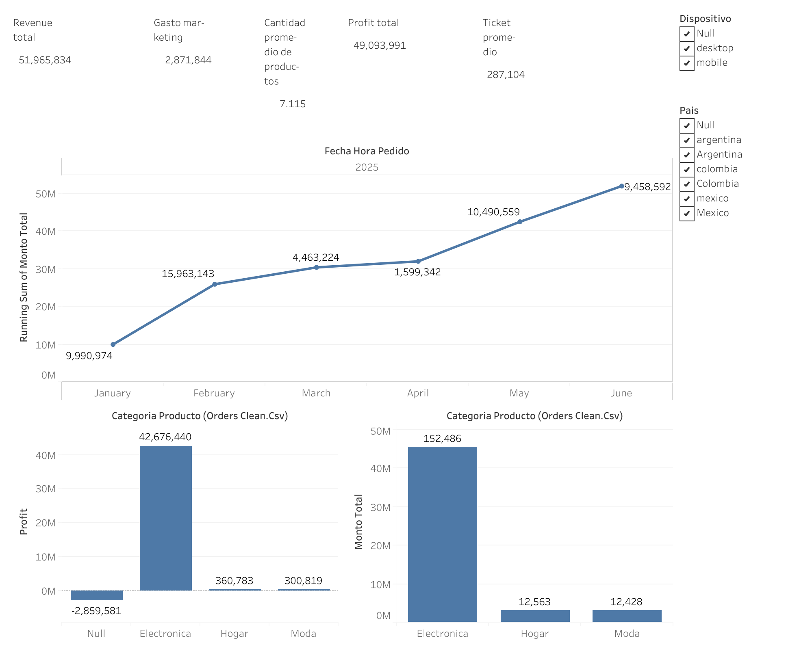

# RappiPlus-dashboard

👉 [Ver el dashboard interactivo en Tableau Public](https://public.tableau.com/app/profile/emma.solorzano7415/viz/Project_17885024557020/Dashboard2)

# Rappi Plus Dashboard

## Objetivo

Dashboard ejecutivo sobre los pedidos de Rappi Plus entre enero y junio de 2025. Sirve para seguir de un vistazo los ingresos, el profit y el gasto en marketing, y está pensado para equipos de negocio y dirección que necesitan decidir dónde poner el foco.

**Preguntas que responde el dashboard:**

- ¿Cómo evolucionaron los ingresos mes a mes durante el primer semestre de 2025?
- ¿Qué categorías y productos generan más ingresos y profit?
- ¿Cómo cambia el rendimiento según el país y el dispositivo (desktop o mobile)?

## Datos

- **Fuente:** `Orders Clean.csv` [indicar origen del dataset y enlace si es público]
- **Periodo:** enero a junio de 2025
- **Tamaño:** [número de filas / pedidos]
- **Variables principales:** Id Pedido, Id Usuario, Fecha Hora Pedido, Nombre Producto, Categoría Producto, Cantidad, Monto Total, País, Dispositivo, Gasto de marketing

## Herramientas

- Tableau Public
- [Excel / SQL / Python]

## Contenido del dashboard

- **Overview Ejecutivo:** panel principal con KPI, evolución mensual acumulada de ingresos y profit e ingresos por categoría.
- **Evolución mensual:** ingresos acumulados de enero a junio.
- **Categoría x Profit / Categoría x Revenue:** comparativa entre Electrónica, Hogar y Moda.
- **Detalle | drill-through:** matriz de Monto Total y Profit por producto y mes, con un resumen de unidades por producto.
- **Detalle de pedidos:** tabla a nivel de pedido (Id Pedido, Id Usuario, año, cantidad y monto).
- **Filtros interactivos:** país, dispositivo y categoría de producto.
- **Indicadores clave (KPI):**
  - Revenue total: 51.965.834
  - Profit total: 49.093.991
  - Gasto de marketing: 2.871.844
  - Ticket promedio
  - Cantidad promedio de productos
  - Vista YTD

## Principales conclusiones

- **Ingresos concentrados en Electrónica:** genera 45,5 M de los 52,0 M de ingresos totales (≈ 88 %) y 152.486 de las ~177.000 unidades vendidas.
- **Un solo producto tira del negocio:** Laptop-Gaming concentra 144.198 unidades (≈ 81 % del total). El resto de productos vende entre 4.000 y 6.300 unidades cada uno.
- **Evolución mensual irregular:** febrero es el mejor mes (15,96 M) y abril el peor (1,60 M). Después hay recuperación en mayo (10,49 M) y junio (9,46 M).
- **Estacionalidad ligada a un producto:** los meses fuertes y débiles de ingresos coinciden con los de Laptop-Gaming (en abril vendió solo 179.714 frente a 8-9 M en enero, mayo y junio).
- **Marketing acotado:** el gasto de marketing (2,87 M) equivale a ≈ 5,5 % de los ingresos.

## Aprendizajes

- Limpieza y preparación de datos (`Orders Clean.csv`).
- Cálculo de KPI y medidas de negocio (profit, ticket promedio, YTD, suma acumulada).
- Diseño de un dashboard ejecutivo con navegación y drill-through a nivel de producto y pedido.
- Uso de filtros interactivos para segmentar por país, dispositivo y categoría.
- Storytelling con datos orientado a decisión.

## Contacto

- LinkedIn: [enlace]
- Perfil de Tableau Public: [enlace]
